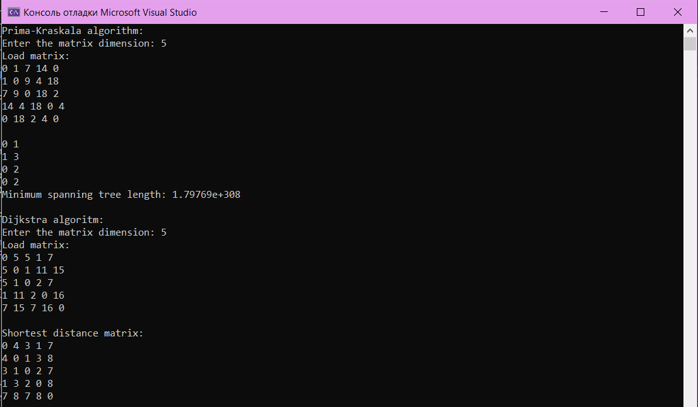

<h1>Laboratory work №4 "Graph algorithms"</h1>

My laboratory work contains implementation 2 algorithms on graph (Dijkstra's & Prima-Krascala)

Input data in my program is dimension of graph's matrix (matrix fill as random generation)

Some results for example:

